# All Mermaid Diagram Types

Test file covering all 32+ Mermaid diagram types for manual and automated verification.

## 1. Flowchart

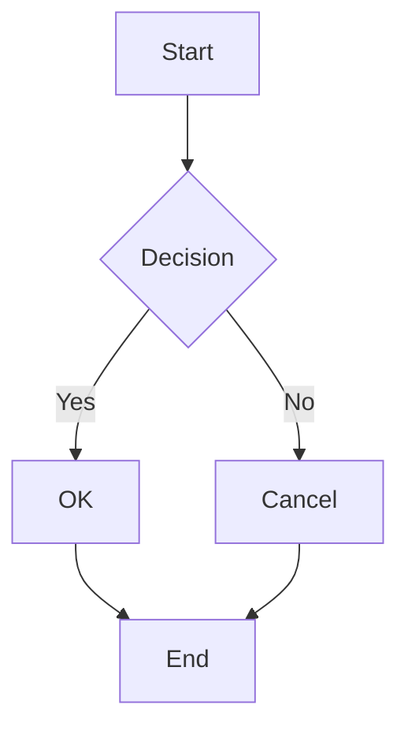

## 2. Graph (flowchart alias)

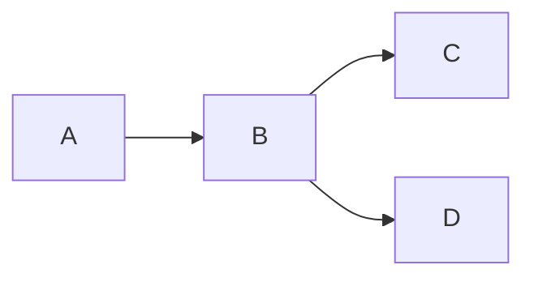

## 3. Sequence Diagram

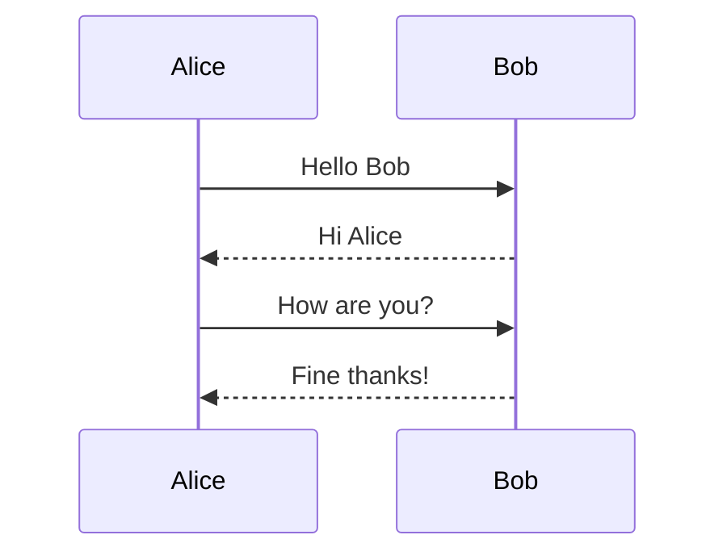

## 4. Class Diagram

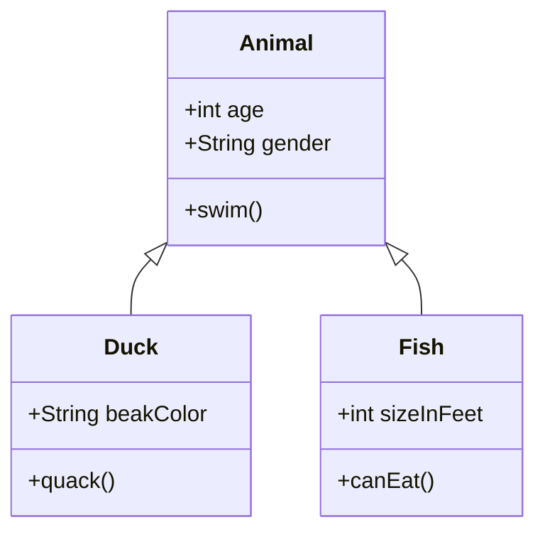

## 5. State Diagram v2

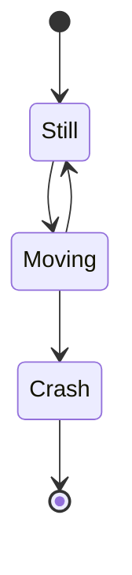

## 6. Entity Relationship Diagram

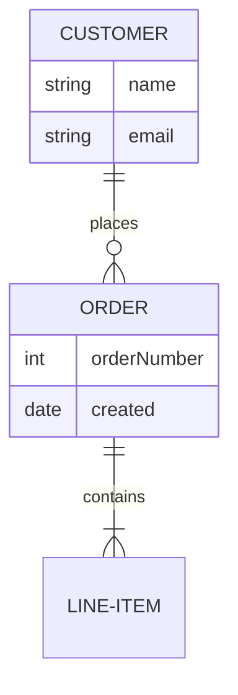

## 7. User Journey

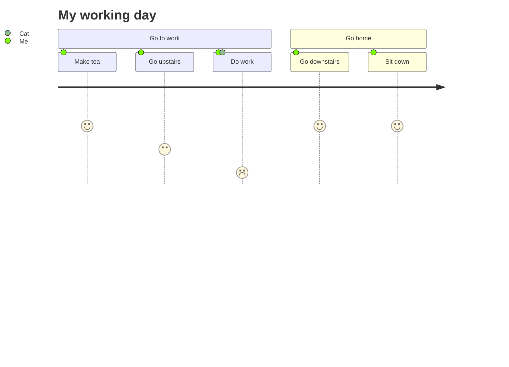

## 8. Gantt Chart

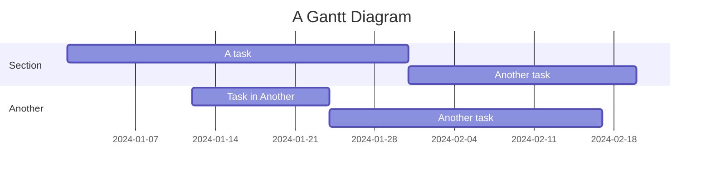

## 9. Pie Chart

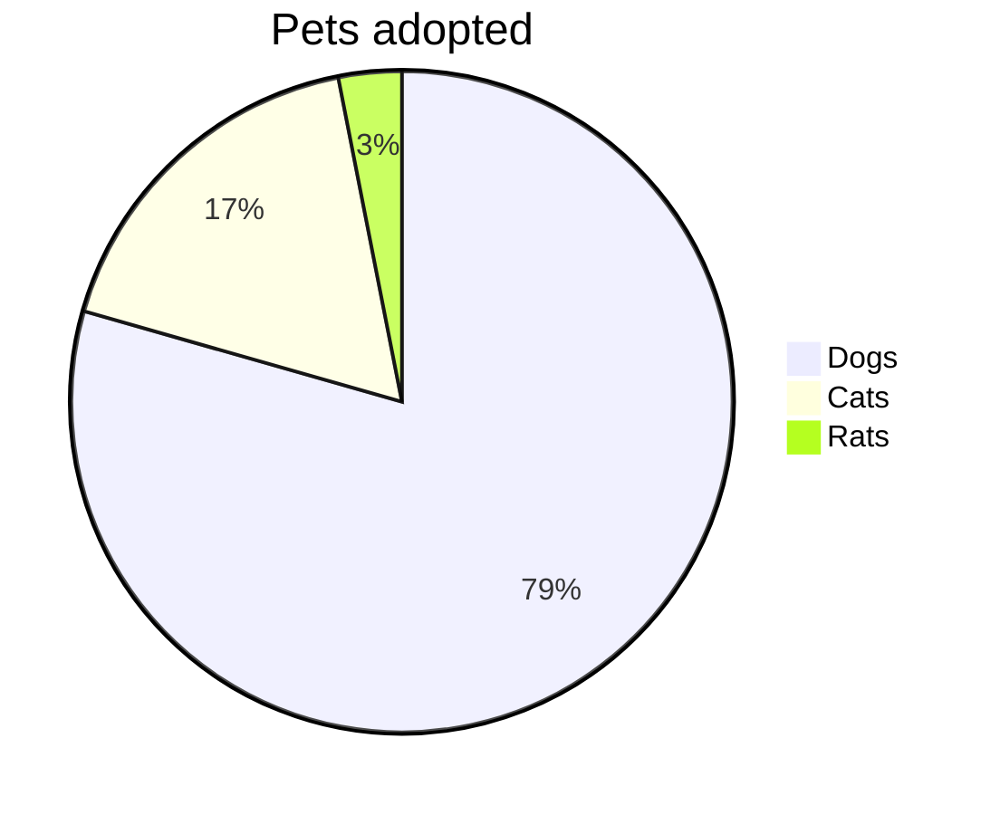

Donut / legend position / highlight slice via config (v11.16.0+):

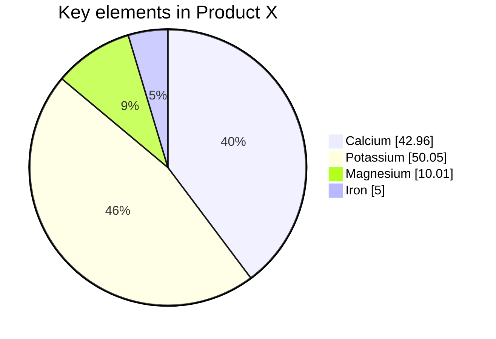

## 10. Git Graph

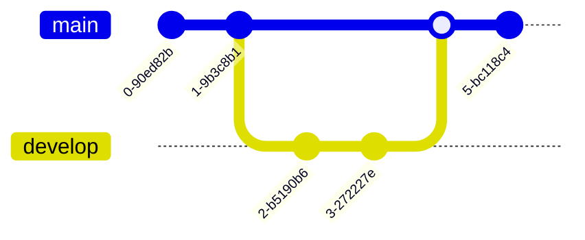

## 11. Mindmap

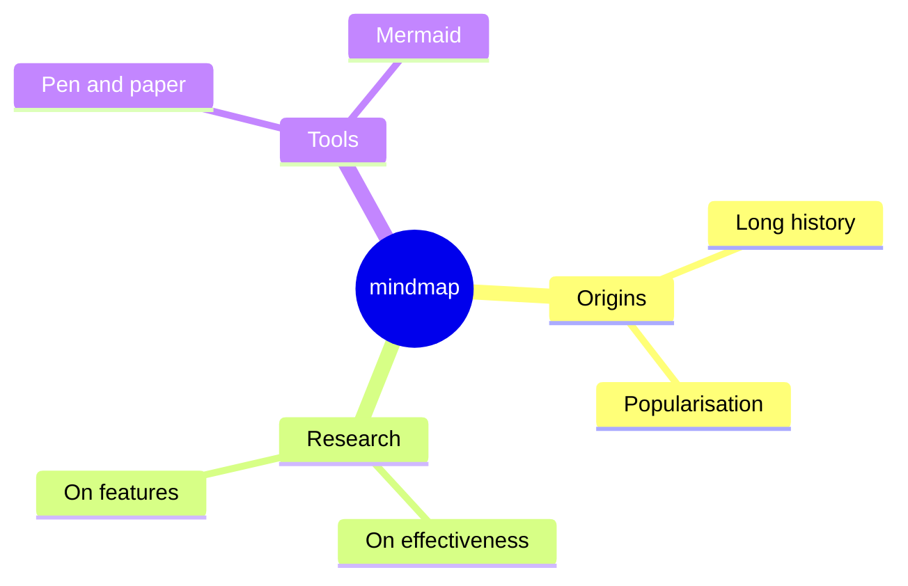

## 12. Timeline

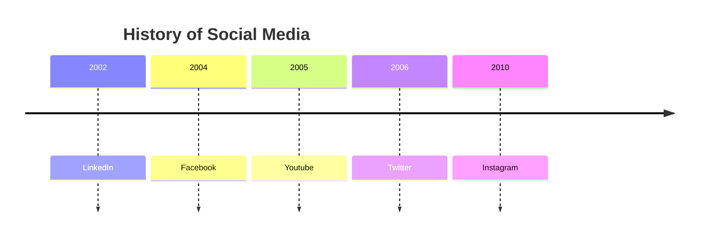

## 13. Quadrant Chart

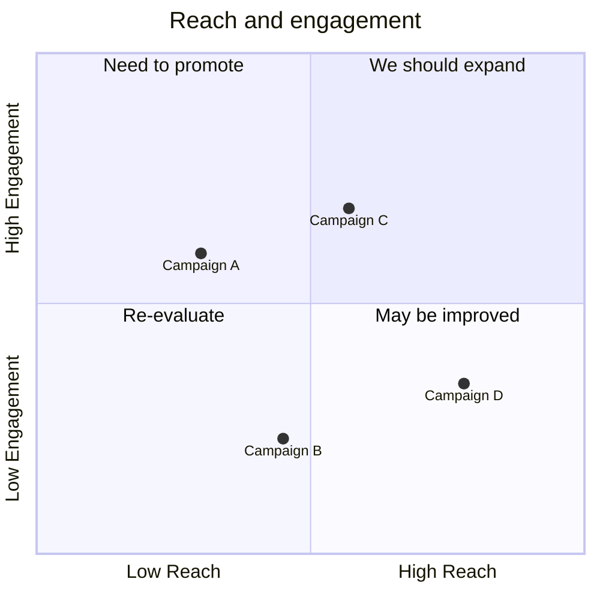

## 14. XY Chart (beta)

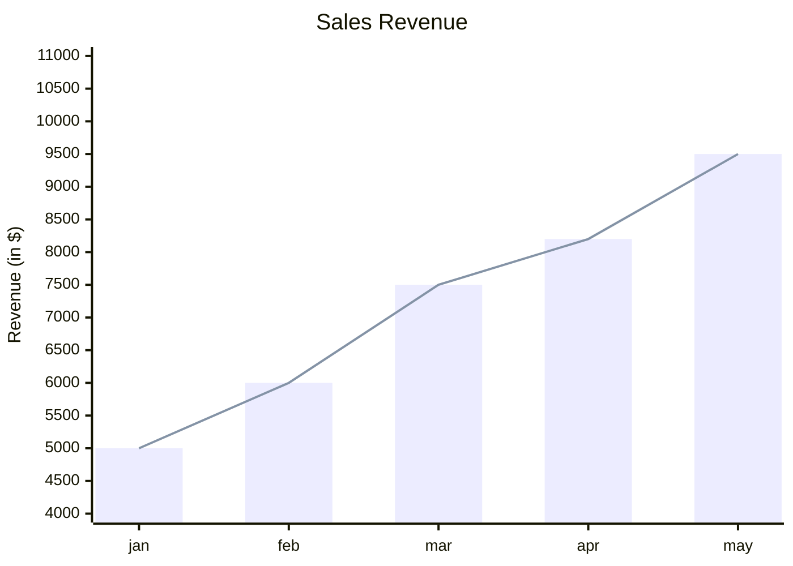

## 15. Sankey (beta)

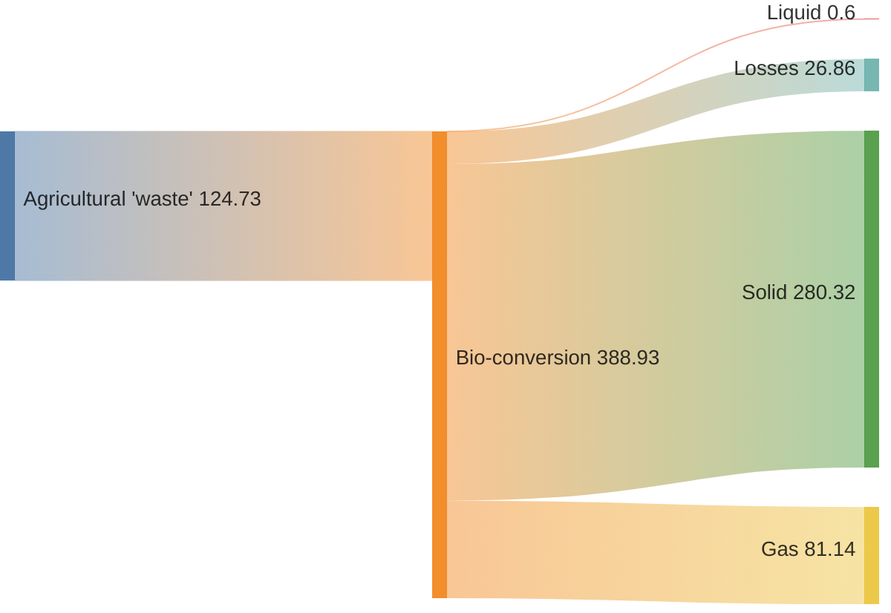

## 16. Requirement Diagram

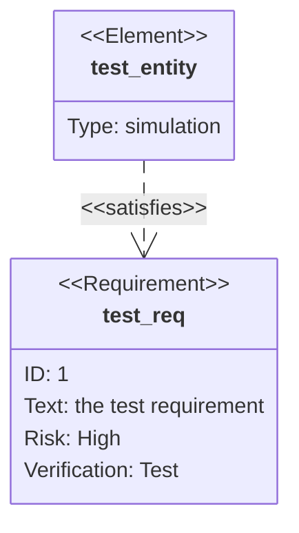

## 17. C4 Context

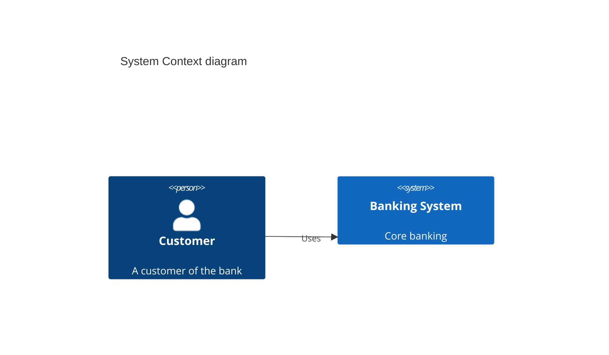

## 18. ZenUML

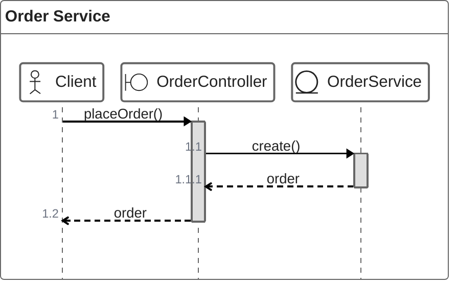

## 19. Block (beta)

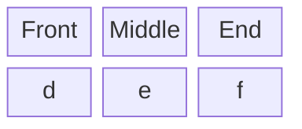

## 20. Packet (beta)

```mermaid
packet-beta
    0-15: "Source Port"
    16-31: "Destination Port"
    32-63: "Sequence Number"
    64-95: "Acknowledgment Number"
```

## 21. Architecture (beta)

```mermaid
architecture-beta
    group api(cloud)[API]

    service db(database)[Database] in api
    service server(server)[Server] in api

    db:R -- L:server
```

## 22. Kanban

```mermaid
kanban
    column1["To Do"]
        task1["Task 1"]
        task2["Task 2"]
    column2["In Progress"]
        task3["Task 3"]
    column3["Done"]
        task4["Task 4"]
```

## 23. Venn (beta)

```mermaid
venn-beta
  title Three overlapping sets
  set A["Alpha"]
  set B["Beta"]
  set C
  union A,B["AB"]
  union B,C["BC"]
  union A,B,C["ABC"]
  style A,B fill:skyblue
```

## 24. Ishikawa (beta)

```mermaid
ishikawa-beta
  Blurry Photo
  Process
    Out of focus
    Shutter speed too slow
  User
    Shaky hands
  Equipment
    LENS
      Dirty lens
    SENSOR
      Damaged sensor
  Environment
    Too dark
```

## 25. Wardley Map (beta)

```mermaid
wardley-beta
title Tea Shop
size [1100, 800]

evolution Genesis -> Custom -> Product -> Commodity

component Cup of Tea [0.79, 0.61]
component Cup [0.73, 0.78]
component Tea [0.63, 0.5]
component Water [0.44, 0.89]
component Kettle [0.57, 0.45]
component Power [0.10, 0.70]

Cup of Tea -> Cup
Cup of Tea -> Tea
Cup of Tea -> Water
Water -> Kettle
Kettle -> Power

evolve Kettle 0.75
```

## 26. TreeView (beta)

```mermaid
treeView-beta
    "src"
        "main"
            "kotlin"
            "resources"
        "test"
            "kotlin"
            "resources"
```

## 27. Treemap (beta)

```mermaid
treemap-beta
"Products"
    "Electronics"
        "Phones": 50
        "Computers": 30
    "Clothing"
        "Men's": 40
        "Women's": 40
```

## 28. Event Modeling

```mermaid
eventmodeling

tf 01 ui CartUI
tf 02 cmd AddItem
tf 03 evt ItemAdded
tf 04 rmo CartView ->> 03

data AddItem01 `json`{
  "itemId": "123"
}
```

## 29. Radar Chart (beta)

```mermaid
radar-beta
  title Product Performance
  axis A, B, C, D, E
  curve Product1{1, 2, 3, 4, 5}
  curve Product2{5, 4, 3, 2, 1}
  showLegend true
  max 10
  ticks 5
```

## 30. Cynefin Framework (beta)

```mermaid
cynefin-beta
  title Incident Response

  complex
    "Investigate root cause"
    "Run chaos experiment"

  complicated
    "Analyze performance data"

  clear
    "Restart service"
    "Apply known fix"

  chaotic
    "Page on-call immediately"

  confusion
    "Unknown failure mode"

  complex --> complicated : "Pattern identified"
  clear --> chaotic : "Complacency"
```

## 31. Railroad Diagram (beta)

```mermaid
railroad-ebnf-beta
title "Arithmetic Expression Grammar"

expression = term ( ( "+" | "-" ) term )* ;
term = factor ( ( "*" | "/" ) factor )* ;
factor = number | "(" expression ")" ;
number = digit+ ;
digit = "0" | "1" | "2" | "3" | "4" | "5" | "6" | "7" | "8" | "9" ;
```

```mermaid
railroad-peg-beta
title "Identifiers (keywords excluded)"

Identifier <- !Keyword Letter Letter* ;
Keyword <- "if" / "else" / "while" ;
Letter <- "a" / "b" / "c" / "_" ;
```

## 32. Swimlane (beta)

```mermaid
swimlane-beta LR
  subgraph sales [Sales team]
    lead[Qualify lead]
    quote[Prepare quote]
  end

  subgraph finance [Finance team]
    review[Review terms]
    approve[Approve quote]
  end

  lead --> quote --> review --> approve
```

---

## Edge Cases

### Empty block (should be skipped gracefully)

```mermaid
```

### Special characters

```mermaid
flowchart TD
    A["Node with 'quotes'"] --> B["Node with <brackets>"]
    B --> C["Node with & ampersand"]
```

### Large diagram (many nodes)

```mermaid
flowchart TD
    N1 --> N2 --> N3 --> N4 --> N5
    N5 --> N6 --> N7 --> N8 --> N9 --> N10
    N10 --> N11 --> N12 --> N13 --> N14 --> N15
    N15 --> N16 --> N17 --> N18 --> N19 --> N20
    N1 --> N10
    N5 --> N15
    N10 --> N20
```
